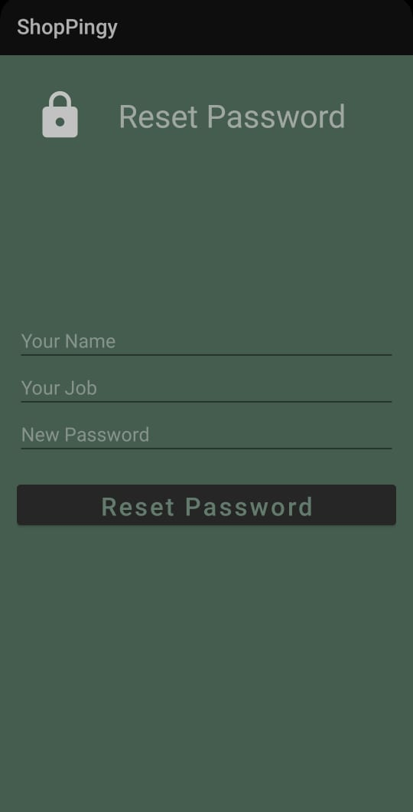

# E-commerce-Mobile-App
- This is an android app used to sell products to users.
## Facilities: 
- Sign up & login facilities.
- Facility to navigate categories and products
- Facility to Search by text, voice and barcode (using Camera)
- Facility to add several products to the shopping cart.
- Facility to add/remove/edit quantities of products in the shopping cart.
- Facility to show order total before submission.
- Facility to determine location of delivery by GPS.
- Define customer’s birthdate using calendar.
- Remember me & forget password recovery facilities.
## System Photos :

